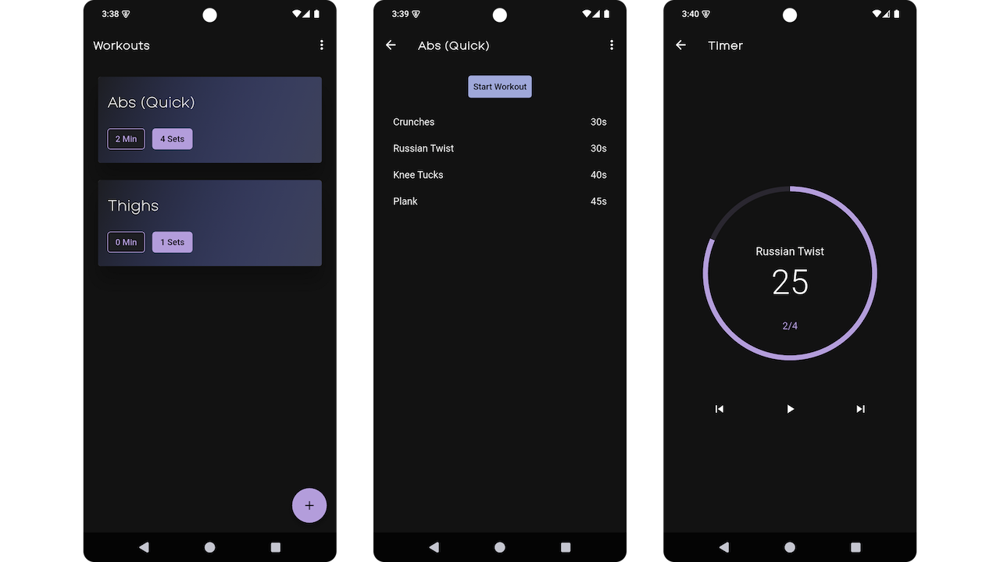

# Count Up

A minimalist exercise timer app built with Flutter that helps track workout routines. Currently built and tested only for Android.

## Snapshots


## Features

**Workout Management**
- Create custom workouts. Add, edit, and organize exercises within workouts.
- Workouts are saved to local storage using Hive.
- Export/import workouts as JSON files

**Timer**
- Circular progress indicator shows remaining time
- Sound alerts at 3 seconds remaining
- Pause, resume, skip forward/backward through exercises
- Screen stays on throughout the workout

## Getting Started
### Installation

1. **Clone the repository**
   ```bash
   git clone https://github.com/sushma1031/count-up.git
   cd flutter-exercise-timer
   ```

2. **Install dependencies**
   ```bash
   flutter pub get
   ```

3. **Run the app**
   ```bash
   flutter run
   ```

## Testing

Run the test suite:
```bash
flutter test
```

## Building for Release

### Android APK
```bash
flutter build apk --split-per-abi
```
